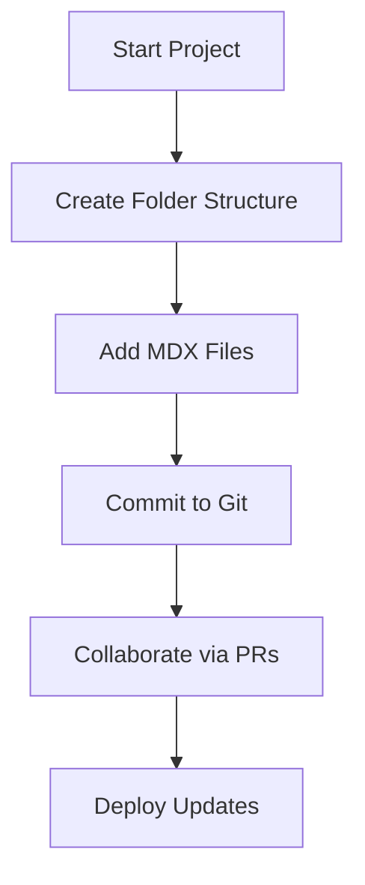

## Overview

You manage project documentation effectively by establishing clear structures, integrating version control, enabling team collaboration, and following organization best practices. This guide walks you through each aspect using practical steps and examples tailored to Cristina Gabriela Raileanu Documentation space.

<Callout kind="tip">
  Start small: Begin with a single project folder to test your structure before scaling.
</Callout>

## Structuring Documentation for Projects

Organize your documentation hierarchically to support multiple projects. Use folders for each project and subfolders for guides, APIs, and changelogs.

<Columns cols={2}>
  <Card title="Project Folder Structure" icon="folder" href="#">
    Create a root-level folder per project.
  </Card>
  <Card title="MDX File Naming" icon="file-text" href="#">
    Use descriptive names like `quickstart.mdx` or `api-reference.mdx`.
  </Card>
</Columns>

Follow these steps to set up your first project structure:

<Steps>
  <Step title="Create Project Folder" icon="folder-plus">
    In your documentation root, add a folder named after your project, such as `my-ai-project/`.
  </Step>
  <Step title="Add Core Files" icon="file-plus">
    Create `README.mdx`, `quickstart.mdx`, and `changelog.mdx`.
  </Step>
  <Step title="Organize Subsections" icon="layout">
    Add subfolders like `guides/`, `api/`, and `reference/`.
  </Step>
</Steps>

## Version Control and Updates

Integrate Git for tracking changes. Commit updates regularly with semantic messages.

<CodeGroup tabs="Git Bash,Terminal">
  ```bash
  git init
  git add .
  git commit -m "feat: initial project documentation structure"
  ```
  ```bash
  git clone https://github.com/yourusername/cristina-docs.git
  git pull origin main
  git commit -m "docs: update quickstart guide"
  git push origin main
  ```
</CodeGroup>

<Callout kind="info">
  Use conventional commits like `feat:`, `docs:`, `fix:` to generate changelogs automatically.
</Callout>

## Collaborating with Team Members

Enable team contributions through platforms like GitHub. Review changes via pull requests.

<Tabs>
  <Tab title="GitHub Workflow" icon="github">
    Create a repository and invite collaborators.

    <Steps>
      <Step title="Invite Collaborators">
        Go to repository settings and add team members.
      </Step>
      <Step title="Review PRs">
        Approve changes before merging to main.
      </Step>
    </Steps>
  </Tab>
  <Tab title="GitLab Workflow" icon="git-branch">
    Use merge requests for structured reviews.

    ```bash
    git remote add origin https://gitlab.com/yourgroup/cristina-docs.git
    git push -u origin main
    ```
  </Tab>
</Tabs>

## Best Practices for Content Organization

Adopt these practices to maintain high-quality documentation.

| Practice | Description | Benefit |
|----------|-------------|---------|
| Consistent Naming | Use kebab-case for files: `user-guide.mdx` | Easy navigation |
| Frontmatter Always | Include `title` and `description` in every file | SEO and previews |
| Visual Components | Use Cards, Steps, and Tabs | Engaging content |
| Regular Audits | Review docs quarterly | Keep information current |

<Expandable title="Advanced Organization Tips" default-open="false">

- Limit pages to 2000 words for readability.
- Use `## H2` headings as the first level.
- Embed code examples with realistic data, like API endpoints to `https://api.example.com/v1/projects`.

</Expandable>



This approach ensures your Cristina Gabriela Raileanu Documentation space remains organized, up-to-date, and collaborative.